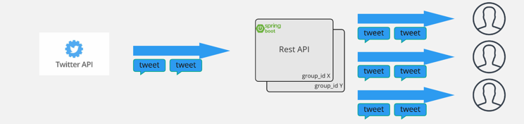
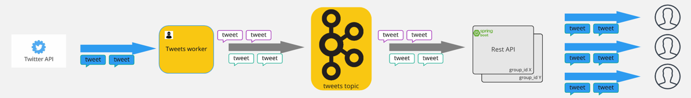
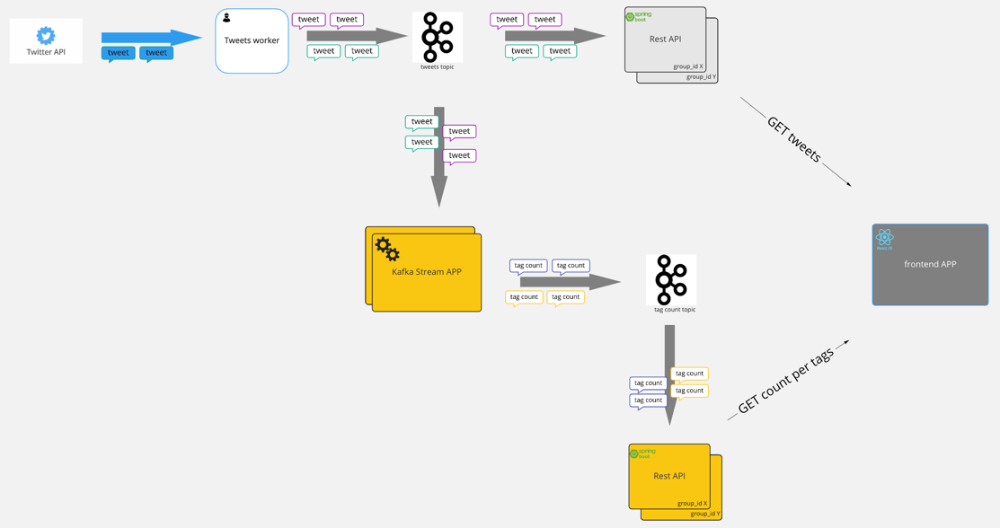

# Streaming twitter with kafka streams and reactor

prerequisites
- a twitter developer account and replace the bearer token value in file `stream-api/src/main/resources/application.yaml`
- docker, npm, maven and java installed

## backend

### stream twitter directly

run `stream-api/src/main/kotlin/simple/Application.kt` with spring profile `direct-twitter`

start streaming event from twitter `curl --location --request GET 'http://localhost:8080/stream/sseTweets'`

### stream raw tweets from kafka directly

start kafka cluster : `docker-compose up`

#### producing data
run `twitter-worker/src/main/kotlin/worker/TwitterWorkerApplication.kt`

#### api to listen to topic
run `stream-api/src/main/kotlin/simple/Application.kt` with spring profile `kafka-twitter`

start streaming event from kafka `curl --location --request GET 'http://localhost:8080/stream/sseTweets'`

### count tweets per tag with kafka stream
#### without state querying

#### with state querying

start kafka cluster : `docker-compose up`

#### streaming app
run `twitter-kafka-stream/src/main/kotlin/stream/TwitterStreamingApplication.kt`

#### producer
run `twitter-worker/src/main/kotlin/worker/TwitterWorkerApplication.kt`

#### api to listen to topic
run `stream-api/src/main/kotlin/simple/Application.kt` with spring profile `kafka-twitter`

start streaming event from kafka `curl --location --request GET 'http://localhost:8080/stream/sseTweets?filters={tag1},{tag2},...{tagN}'`

## start frontend
cd into `cd frontend-app/ui` , run `npm run start`
